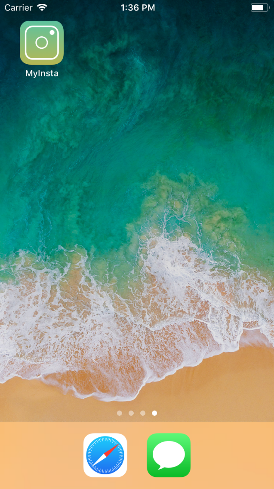
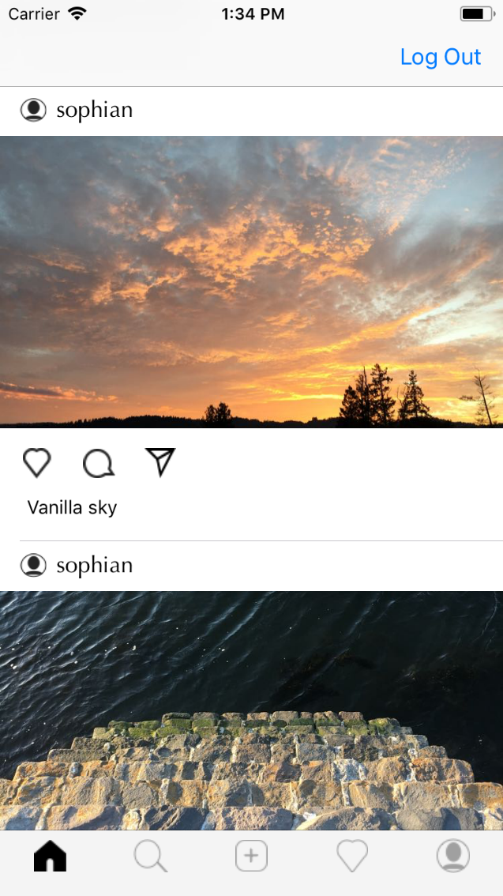
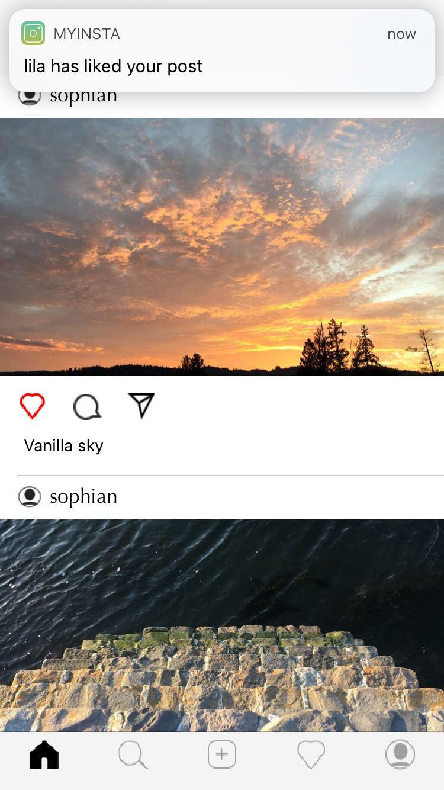

# Instragram with Back end as a service (BaaS)

  This project showcase how to build a lighter version of instagram using BaaS techologies such as Parse. This means no backend code was written, the entirety of the code is in the front end. Your Parse server can be running anywhere but I would recommend aws + bitnami (more info below). Similarly, the same can be built with Firebase or other baas providers. 
  Finally notifications were added using OneSignal.  

## The features available
* Login / sign up.  
* Pictures upload.  
* Likes + notifications.   
* Instragram like icons.  

  

## Tools used
* Xcode: app is developed in Swift.  
* Parse: as back end server.  
* AWS: to host Parse.  
* One signal: for app nofitications.  
* Sktech: to design/create icons.  

## Run the app
1- Check out the code locally.  
2- Create your parse server:  [sashido](https://www.sashido.io/)  or any parse hosting solution.  
3- Update your ParseClientConfiguration in the AppDelegate file.  
4- Run the app! (use Iphone 6/6plus simulator for optimal size display)
  
Bonus: Nofitications  
5- Create an account with OneSignal.  
6- Update OneSignal.initWithLaunchOptions in the AppDelegate file.  

This is obviously not a production app but I hope this helps you understand how BaaS work as well as some foundamental of app developement in swift.
